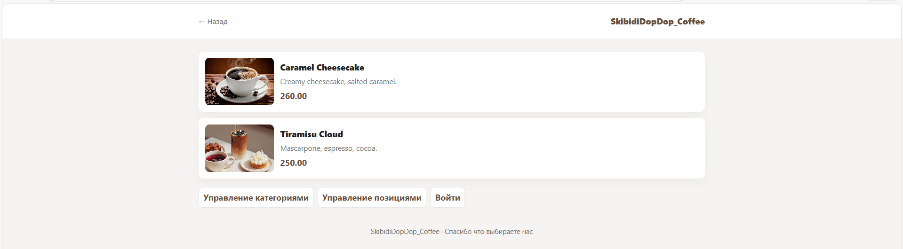
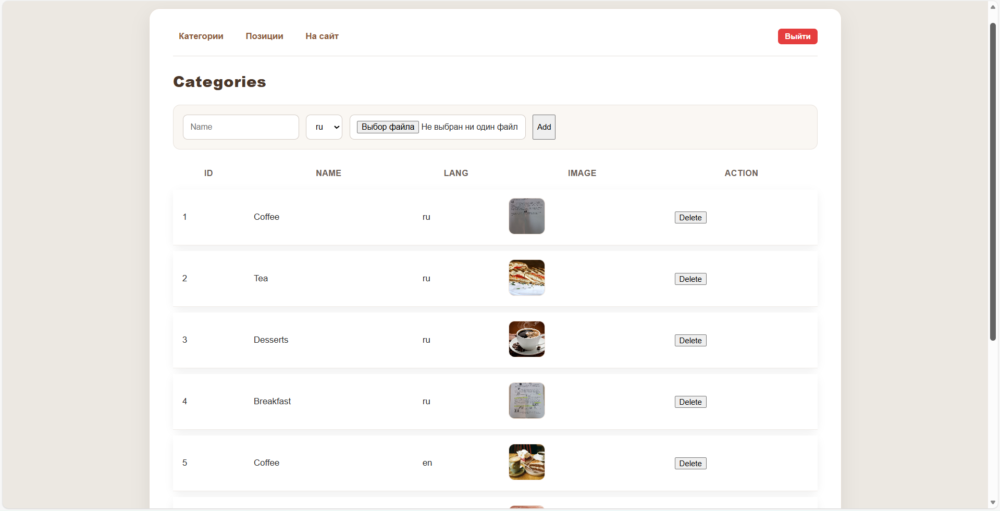
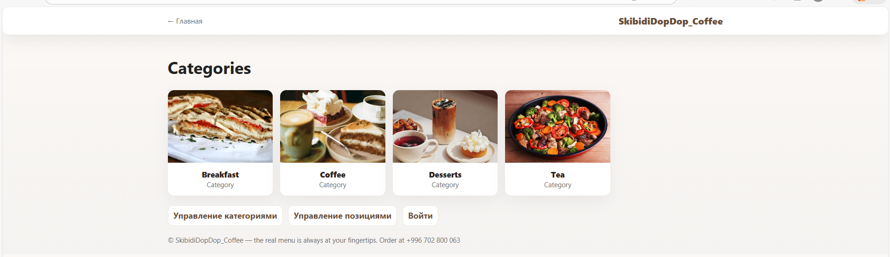

# CoffeeShop

Coffee shop menu web app with public catalog and admin management.

## Features
- Public menu with language switch (ru/en)
- Category and item management in the admin panel
- Image upload for categories and items
- REST endpoints for admin and images

## Tech Stack
- Java 17, Spring Boot 3.5
- Thymeleaf
- PostgreSQL
- Maven

## Requirements
- Java 17
- PostgreSQL
- Maven (or use the Maven wrapper)

## Configuration
The app reads env vars from a local `.env` file if present.

Key variables (defaults in `src/main/resources/application.properties`):
- SPRING_DATASOURCE_URL
- SPRING_DATASOURCE_USERNAME
- SPRING_DATASOURCE_PASSWORD
- ADMIN_USER
- ADMIN_PASS
- FILE_UPLOAD_DIR

Default admin credentials: admin / admin123

## Run
Windows:

```bash
mvnw.cmd spring-boot:run
```

Linux or macOS:

```bash
./mvnw spring-boot:run
```

## URLs
- http://localhost:8080/
- http://localhost:8080/admin/categories
- http://localhost:8080/admin/items
- http://localhost:8080/login

## Screenshots




